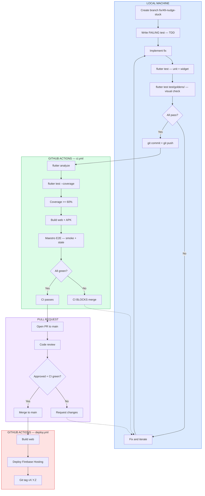
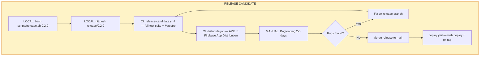

# Dytty — Testing Strategy

> Comprehensive testing guide covering all test layers, tools, workflows, and lessons learned.

---

## Philosophy

**TDD is mandatory.** Every feature and bug fix follows: tests first -> implement -> iterate -> verify.

Every bug fix must include a test that reproduces the bug before the fix. Every feature must include tests for its acceptance criteria. E2E tests are required for cross-screen UI state changes.

---

## Test Pyramid (5 Layers)

```
                 /\            Layer 5: Black Box E2E (Maestro)
                /  \           - Screen-only, no code access
               /----\          Layer 4: Integration Tests (Patrol)
              /      \         - On-device, Dart, widget tree + native OS
             /--------\        Layer 3: Golden Tests
            /          \       - Visual regression, pixel comparison
           /------------\      Layer 2: Widget Tests (Robot pattern)
          /              \     - Individual UI component rendering
         /----------------\    Layer 1: Unit Tests
        /                  \   - Bloc, repos, models, services
       /____________________\
```

| Layer | Tool | Location | Speed | When it runs |
|-------|------|----------|-------|-------------|
| Unit | `flutter test` | `test/` | ~2s | Dev loop, every PR |
| Widget | `flutter test` | `test/widgets/` | ~3s | Dev loop, every PR |
| Golden | `flutter test --update-goldens` | `test/goldens/` | ~5s | Local only (see [#48]) |
| Integration | Patrol | `integration_test/` | ~60s/flow | Release candidate only |
| Black Box E2E | Maestro | `.maestro/` | ~90s/flow | CI on every PR + release |

[#48]: https://github.com/Chitiiran/dytty/issues/48

---

## Layer 1: Unit Tests

**Libraries:** `bloc_test`, `fake_cloud_firestore`, `mockito`

**What to test:**
- Bloc state transitions (events -> states)
- Repository CRUD operations (using `FakeFirebaseFirestore`)
- Model serialization/deserialization (toMap/fromMap)
- Service interfaces (using fakes/mocks)

**Commands:**
```bash
flutter test                          # Run all unit tests
flutter test test/features/auth/      # Run specific directory
flutter test --coverage               # With coverage report
```

**Conventions:**
- Test files mirror `lib/` structure: `lib/features/auth/` -> `test/features/auth/`
- File naming: `<source>_test.dart`
- Use `blocTest<Bloc, State>()` for Bloc testing
- Use `FakeFirebaseFirestore()` — never mock Firestore

### Unit Test Gotchas & Lessons Learned

1. **`FakeFirebaseFirestore` does not enforce security rules** — Your tests will pass even if Firestore rules would block the operation in production. Test rules separately or accept this gap.

2. **`blocTest` runs events synchronously by default** — If your Bloc uses `await` in event handlers, use `wait: Duration(...)` or the `build`/`act`/`expect` pattern carefully. Missing `wait` leads to flaky tests that pass locally but fail in CI.

3. **Sealed class events can't be mocked** — `JournalEvent` is a sealed class, so `registerFallbackValue(FakeJournalEvent())` won't compile. Don't stub `bloc.add()` — `MockBloc` from `bloc_test` handles it automatically.

4. **`FakeFirebaseFirestore` auto-ID collisions** — When testing multiple `add()` calls in the same test, the fake may assign predictable IDs. Don't assert on auto-generated document IDs.

5. **Timezone sensitivity** — Tests using `DateTime.now()` can fail around midnight or in different CI timezones. Use fixed dates like `DateTime(2026, 3, 15)` in test data.

---

## Layer 2: Widget Tests (Robot Pattern)

**Libraries:** `flutter_test`, `bloc_test`, `mocktail`

**What to test:**
- Individual widget rendering with given props
- Tap handlers fire correctly
- Loading/error/empty states display properly
- Accessibility labels present

**Location:** `test/widgets/` mirroring `lib/features/` structure.

**Robot Pattern:** One Robot class per screen encapsulates interaction logic. Tests read like user stories:

```dart
// test/robots/home_screen_robot.dart
class HomeScreenRobot {
  HomeScreenRobot(this.tester);
  final WidgetTester tester;

  void expectNudgeCardVisible() {
    expect(find.textContaining("haven't journaled"), findsOneWidget);
  }
  // ...
}

// test/widgets/home_screen_test.dart — reads like a spec
testWidgets('nudge card visible when no entries', (tester) async {
  await tester.pumpApp(const HomeScreen());
  final robot = HomeScreenRobot(tester);
  robot.expectNudgeCardVisible();
});
```

**Key files:**
- `test/helpers/pump_app.dart` — shared test setup with mock Blocs
- `test/robots/` — Robot classes for each screen
- `test/widgets/` — Widget test files

**Commands:**
```bash
flutter test test/widgets/       # Run widget tests only
```

### Widget Test Gotchas & Lessons Learned

1. **`mocktail` vs `mockito` — don't mix them** — Widget tests use `mocktail` (required by `bloc_test`'s `MockBloc`/`MockCubit`). Unit tests use `mockito`. They have different stub syntax (`when(() => ...)` vs `when(mock.method()).then...`). Pick the right one per test file.

2. **Stream stubs are required for BlocBuilder** — Mocking `bloc.state` alone isn't enough. You must also stub `bloc.stream` or `BlocBuilder` will throw. Use `when(() => mockBloc.stream).thenAnswer((_) => const Stream.empty())`.

3. **`pumpAndSettle` can hang on animations** — If a widget uses `flutter_animate` or repeating animations, `pumpAndSettle` never completes. Use `pump(Duration(...))` instead for a fixed wait.

4. **GoogleFonts throws in tests** — `GoogleFonts.inter()` triggers HTTP font downloads that fail in the test environment. The Inter font is bundled in `assets/fonts/` and `test/flutter_test_config.dart` sets `GoogleFonts.config.allowRuntimeFetching = false`. The test-safe wrapper in `test/helpers/pump_app.dart` handles this.

5. **Theme must be provided** — Widgets that use `Theme.of(context)` will crash without a `MaterialApp` ancestor. Always use `pumpApp()` from `test/helpers/pump_app.dart`, not raw `pumpWidget()`.

6. **`find.text` vs `find.textContaining`** — `find.text('Progress')` matches exact strings only. For dynamic text like "Progress 3 of 5", use `find.textContaining('Progress')`.

---

## Layer 3: Golden Tests (Visual Regression)

**Tool:** Built-in `matchesGoldenFile` from `flutter_test`.

**What to capture:** Login screen (default, loading, error, dark), journal screen (empty, with entries, dark), dashboard states.

**Location:** `test/goldens/` with baseline PNGs in `test/goldens/fixtures/`.

**Commands:**
```bash
flutter test test/goldens/                       # Verify goldens match
flutter test --update-goldens test/goldens/      # Regenerate baseline PNGs
```

**Workflow:**
1. Write golden test with `matchesGoldenFile('fixtures/name.png')`
2. First run: `flutter test --update-goldens test/goldens/` to generate baselines
3. Commit the PNG files to git
4. Run `flutter test test/goldens/` locally — fails if pixels differ

**CI status:** Golden tests are tagged `@Tags(['golden'])` and excluded in CI via `--exclude-tags=golden`. Cross-platform font rendering differences between Windows (dev) and Ubuntu (CI) cause pixel mismatches. Tracked in [#48].

### Golden Test Gotchas & Lessons Learned

1. **Cross-platform rendering breaks goldens** — The same font renders differently on Windows (DirectWrite) vs Ubuntu (FreeType). Baselines generated on Windows will always fail on Ubuntu CI. Fix: use `alchemist` package for platform-independent rendering, or generate baselines on the CI platform.

2. **GoogleFonts must be bundled, not downloaded** — `GoogleFonts.inter()` triggers HTTP requests that fail in tests. Solution: bundle Inter TTF files in `assets/fonts/`, register in `pubspec.yaml`, and set `GoogleFonts.config.allowRuntimeFetching = false` in `test/flutter_test_config.dart`.

3. **`testWidgets` only accepts `bool` for `skip`** — Unlike the base `test` package which accepts `String`, `testWidgets` only takes `bool?`. Use `skip: true`, not `skip: 'reason string'`.

4. **Golden PNGs can be large** — Login screen goldens are ~740KB each. Commit them but be aware of repo size. Consider `.gitattributes` with Git LFS if golden count grows significantly.

5. **Animation frames affect goldens** — If you capture during an animation, each run may produce different frames. Always `pump(Duration(seconds: 1))` before capturing to let animations settle.

6. **`goldenWrapper` provides isolated Blocs** — The `test/goldens/golden_test_helper.dart` provides a `goldenWrapper()` function that creates fresh mock Blocs per test. Pass state overrides via parameters like `authState:`, `journalState:`, etc.

---

## Layer 4: Integration Tests (Patrol)

**Tool:** Patrol 3.13+

**Why Patrol over plain `integration_test`:** Dytty uses mic permission (voice notes), notification permission (reminders), and Google Sign-In (native OAuth). All trigger native OS dialogs that only Patrol can interact with.

**Packages:** `patrol: ^3.13.0`, `patrol_finders: ^2.4.0` in `dev_dependencies`.

**Structure:**
```
integration_test/
├── robots/                        # Robot classes (same vocabulary as widget test robots)
│   ├── home_screen_robot.dart
│   ├── journal_screen_robot.dart
│   └── auth_robot.dart
├── flows/
│   ├── auth_flow_test.dart        # Login -> verify home -> logout
│   ├── journal_crud_test.dart     # Add -> verify -> edit -> delete
│   └── dashboard_state_test.dart  # Add entries -> verify progress updates
└── app_test_setup.dart            # Common setup: pump app with emulator config
```

**Commands:**
```bash
bash scripts/patrol-test.sh                    # Run all integration tests
bash scripts/patrol-test.sh --flow auth        # Run specific flow
bash scripts/patrol-test.sh --skip-build       # Skip APK build
```

**When to run:** Release candidates only (too slow for every PR).

**Status:** Scaffold created with commented-out implementations. Patrol packages not yet added to `pubspec.yaml` (waiting for first native-dialog feature to be tested).

### Integration Test Gotchas & Lessons Learned

1. **Patrol requires native build** — Unlike widget tests, Patrol tests compile to a real APK and run on a device/emulator. Build time is ~60s before any test runs.

2. **Permission dialogs are OS-version-specific** — The "Allow microphone" dialog text changes between Android API levels. Use Patrol's `$.native.grantPermissionWhenInUse()` instead of tapping by text.

3. **Firebase emulator setup must happen in-app** — Patrol launches the real app, so emulator config must be in `main.dart` (controlled by `--dart-define=USE_EMULATORS=true`), not in test setup.

4. **Shared Robot vocabulary** — Integration test Robots should use the same method names as widget test Robots (`expectNudgeCardVisible()`, `tapMicFab()`) so the mental model is consistent across layers.

---

## Layer 5: E2E Tests — Android (Maestro)

**Tool:** Maestro 2.3.0+

**How it works:**
1. Build debug APK with emulator flag
2. Install APK on Android emulator via ADB
3. Maestro runs YAML flows — interacts with the app via accessibility/view hierarchy
4. `takeScreenshot` captures visual state at key points for developer review
5. CI uploads screenshots as artifacts for every PR

### Prerequisites

- **Maestro CLI**: `curl -fsSL "https://get.maestro.mobile.dev" | bash`
- **JDK 17+** (JDK 21 available at `C:\Program Files\Eclipse Adoptium\jdk-21.0.10.7-hotspot`)
- **ADB**: Android SDK platform-tools (at `$LOCALAPPDATA/Android/Sdk/platform-tools/`)
- **Android emulator** running and visible via `adb devices`
- **Firebase emulators** running (Auth :9099, Firestore :8080)

### Commands

```bash
# Run all flows
bash scripts/maestro-test.sh

# Run specific feature flows
bash scripts/maestro-test.sh --flow auth
bash scripts/maestro-test.sh --flow journal

# Run by tag
bash scripts/maestro-test.sh --tags smoke

# Skip APK build (reuse existing)
bash scripts/maestro-test.sh --skip-build

# Interactive flow builder (great for debugging selectors)
maestro studio
```

### Flow Structure

```
.maestro/
├── config.yaml
├── helpers/
│   └── login.yaml                # Reusable: emulator login (clearState + sign in)
├── auth/
│   ├── login-flow.yaml           # Emulator login -> verify home screen
│   └── logout-flow.yaml          # Login -> settings -> sign out -> verify login screen
├── journal/
│   ├── add-entry-flow.yaml       # Add entry to Positive Things category
│   ├── dashboard-flow.yaml       # Verify calendar, progress, nudge card, FAB
│   └── navigate-days-flow.yaml   # Navigate between days via chevrons
├── state/
│   ├── nudge-disappears-after-entry.yaml   # #21 regression: nudge gone after add
│   ├── progress-updates-after-entry.yaml   # #22 regression: progress 0->1->2 of 5
│   ├── all-categories-complete.yaml        # Fill all 5 -> "All categories complete!"
│   └── streak-updates-after-entry.yaml     # Streak shows "1 day" after first entry
└── screenshots/                  # Git-ignored output directory
```

### Tags

| Tag | Purpose | When to run |
|-----|---------|-------------|
| `smoke` | Core happy paths — login, dashboard, add entry, nudge + progress state | Every PR (CI) |
| `state` | State management regression tests (cross-screen updates) | Every PR (CI) |
| `release` | Full regression suite | Release candidates only |
| `auth` | Authentication flows only | Auth changes |
| `journal` | Journal CRUD + navigation | Journal changes |
| `dashboard` | Dashboard element verification | Dashboard/state changes |

### Writing Maestro Flows

**Flow file anatomy:**
```yaml
appId: com.dytty.dytty          # App package ID
name: "Human-readable name"
tags:
  - smoke
  - feature-area
---
# Commands (sequential)
- launchApp:
    clearState: true

- takeScreenshot: "feature/01-step-name"

- assertVisible: "Button Text"

- tapOn: "Element text or regex"

- waitForAnimationToEnd:
    timeout: 5000

- inputText: "typed content"
```

**Key Maestro commands:**
| Command | Usage |
|---------|-------|
| `launchApp` | Start app (with `clearState: true` for clean slate) |
| `tapOn` | Tap by text, id, or regex pattern |
| `assertVisible` | Verify element is on screen |
| `inputText` | Type into focused field |
| `takeScreenshot` | Capture PNG for visual verification |
| `waitForAnimationToEnd` | Wait for Flutter transitions to settle |
| `scroll` / `scrollUntilVisible` | Scroll to find elements |
| `back` | Android back button |
| `pressKey` | Simulate hardware key (Enter, etc.) |
| `runFlow` | Compose flows (e.g., reuse login) |

**Element identification (what Maestro sees):**
- `tooltip` on `IconButton` -> text content
- `Semantics(label:)` -> accessibility label
- Visible text on widgets
- Resource IDs (less common in Flutter)

**Key semantic labels in Dytty:**

| Label | Widget |
|-------|--------|
| `"Sign in anonymously (emulator)"` | Emulator login button |
| `"Sign in with Google"` | Google login button |
| `"\\?"` | Settings icon button (shows as `?` in accessibility tree) |
| `"Record voice note"` | Mic FAB tooltip |
| `"Calendar"` | Calendar widget |
| `"Progress X of Y"` | Progress card |
| `"Today button"` | Write journal button |
| `"Previous day"` / `"Next day"` | Journal day navigation |
| `"Add [Category] entry"` | Category add buttons |
| `"Journal entry: [text]"` | Entry tiles |
| `"Edit entry"` / `"Delete entry"` | Entry action buttons |

### Maestro Gotchas & Lessons Learned

1. **`assertVisible` does NOT do substring matching** — it matches against the full `accessibilityText` of a node. Use regex `".*partial text.*"` for partial matching.

2. **Curly/smart apostrophes** — Source code may use `\u2019` (right single quote) in strings like "haven't". Maestro can't match literal `'`. Use regex: `"You haven.*journaled today.*"`.

3. **Flutter cold start timing** — `waitForAnimationToEnd` completes instantly if no animation is detected (white screen = no pixel changes). Chain triple `waitForAnimationToEnd` after login to catch route transition -> loading spinner -> data load animations.

4. **Parallel flow interference** — Flows sharing an emulator with `clearState: true` can interfere with each other. The runner script (`scripts/maestro-test.sh`) runs each flow individually and sequentially to avoid this.

5. **`scrollUntilVisible` + `centerElement: true`** — When elements are below the fold (like the 5th category card), `centerElement: true` ensures the element is scrolled to center, not just barely visible at the edge. Without it, tap targets may be partially off-screen.

6. **`retryTapIfNoChange: true`** — Use on buttons that may not register the first tap (e.g., after scroll, or when the view is still settling).

7. **`inputText` for autofocused fields** — If a TextField has `autofocus: true`, you can use `inputText` directly without tapping the field first.

8. **Stylus handwriting dialog** — Android emulators may show "Try out your stylus" dialog when tapping text fields. Disable with: `adb shell settings put secure stylus_handwriting_enabled 0`.

9. **Firebase emulator host on Android** — Use `10.0.2.2` (not `localhost`) to reach the host machine from an Android emulator.

10. **Settings button accessibility** — The settings `IconButton` with a `?` icon renders as `"?"` in the accessibility tree, not the tooltip text. Tap with: `tapOn: "\\?"`.

---

## E2E Tests — Web (Playwright)

**Tool:** Playwright v1.50.0

**How it works:**
1. Build web app with emulator flag: `flutter build web --dart-define=USE_EMULATORS=true`
2. Serve the build: `npx serve build/web -l 5555`
3. Playwright drives headless Chromium against the served app
4. Firebase emulators provide backend (Auth :9099, Firestore :8080)

**Commands:**
```bash
npm install                           # Install Playwright
npx playwright test                   # Run all E2E tests
npx playwright test --headed          # Run with visible browser
npx playwright test --debug           # Debug mode (step through)
```

**Structure:**
```
e2e/
├── auth.spec.ts          # Login/sign-out flows
├── journal.spec.ts       # CRUD operations
├── home-state.spec.ts    # Dashboard state management
├── debug.spec.ts         # Debug-specific tests
└── helpers.ts            # Firebase emulator setup, Flutter DOM helpers
```

**Key helpers:**
- `clearEmulatorAuth()` / `clearEmulatorFirestore()` — reset emulator state
- `waitForFlutterReady()` — wait for `flutter-view` + `flt-semantics` elements
- `signInAnonymously()` — click emulator debug button, wait for navigation
- `clickByLabel()` / `expectTextVisible()` — accessibility tree queries

**Config:** `playwright.config.ts` — timeout 120s per test, 180s server startup, HTML reporter with screenshots on failure.

### Playwright Gotchas & Lessons Learned

1. **Flutter web semantics are in shadow DOM** — Flutter renders into a shadow root inside `flutter-view`. Use `page.locator('flt-semantics')` to query the accessibility tree, not regular DOM selectors.

2. **`tooltip` renders as text content** — `IconButton(tooltip: 'Settings')` becomes a clickable element with text "Settings" in the Flutter web accessibility tree. Use `getByRole('button', { name: 'Settings' })`.

3. **`Semantics(label:)` vs visible text** — `Semantics` labels are only visible to the accessibility tree. Visible text on widgets is also exposed. Prefer `Semantics` for test stability (decoupled from UI copy changes).

4. **Firebase emulators must be running** — Playwright tests require `firebase emulators:start` running in a separate terminal. The `webServer` config in `playwright.config.ts` handles serving the built app but not emulators.

5. **Cold start is slow** — Flutter web takes 10-20s to fully initialize (compile shaders, load fonts, hydrate). Use `waitForFlutterReady()` which polls for `flt-semantics` elements before interacting.

6. **Cleartext HTTP for emulators** — Web builds connecting to localhost emulators work fine (no CORS issues), but Android builds need `network_security_config.xml` for cleartext traffic to `10.0.2.2`.

---

## Screenshot-Driven AI Development Workflow

This is the primary workflow for AI-assisted development with Maestro:

1. **Write unit tests** (`flutter test`) — fast TDD cycle for logic
2. **Implement** — minimum code to pass unit tests
3. **Run Maestro flows** — `bash scripts/maestro-test.sh`
4. **Review screenshots** — developer inspects `.maestro/screenshots/<timestamp>/` for visual correctness
5. **Iterate** — AI agent adjusts code based on screenshot feedback
6. **CI verification** — PR triggers Maestro job, screenshots uploaded as artifacts

**In CI (GitHub Actions):**
- The `maestro` job runs `smoke`-tagged flows on every PR and main push
- Screenshots are uploaded as artifacts (14-day retention)
- Download from: Actions tab -> workflow run -> Artifacts -> `maestro-screenshots`
- JUnit XML results included for pass/fail reporting

---

## End-to-End Development Workflow

This walks through fixing a bug from discovery to production, showing exactly **what runs where** at each step.

### Workflow Diagram



**Colour key:**
- Blue = Local machine (your laptop)
- Green = GitHub Actions CI (automatic on push)
- Purple = Manual human steps (PR review)
- Red = Production deploy (automatic on main merge)

### Release Candidate Flow (separate from bug fixes)



---

### Phase-by-Phase Detail

#### Phase 1: Local Development (your machine)

| Step | What | Command | Time |
|------|------|---------|------|
| 1 | Create branch from main | `git checkout -b fix/49-nudge-stuck` | instant |
| 2 | Write failing test (TDD) | Write test in `test/`, run `flutter test` — must FAIL | ~2s |
| 3 | Implement the fix | Edit source code | varies |
| 4 | Run unit + widget tests | `flutter test` | ~5s |
| 5 | Run golden tests | `flutter test test/goldens/` | ~5s |
| 6 | All pass? | If no -> iterate (step 3). If yes -> continue | — |
| 7 | Commit and push | `git commit`, `git push -u origin fix/49-nudge-stuck` | instant |

**What does NOT run locally:** Maestro E2E, Patrol integration tests, coverage enforcement. You *can* run these locally (`bash scripts/maestro-test.sh`) but they're slow (~90s/flow) so they're not part of the fast TDD loop.

#### Phase 2: CI Pipeline (GitHub Actions — automatic on push)

Two jobs run in parallel:

**Job 1: Analyze, Test & Build** (~2 min)

| Check | What | Blocks merge? |
|-------|------|---------------|
| Analyze | `flutter analyze --no-fatal-warnings --no-fatal-infos lib test` | Yes (errors only) |
| Test | `flutter test --coverage --exclude-tags=golden` | Yes |
| Coverage | Must be >= 60% | Yes |
| Build | Web + debug APK | Yes |

**Job 2: Maestro Android E2E** (~5 min)

| Check | What | Blocks merge? |
|-------|------|---------------|
| E2E | Boot emulator, install APK, run `smoke` + `state` tagged flows | Yes |

If CI fails, fix locally, push again. CI re-runs automatically.

#### Phase 3: Pull Request (GitHub — manual)

| Step | What | Who |
|------|------|-----|
| Open PR | PR to `main` with description | You |
| Review | Code review | You / reviewer |
| Merge | When approved + "Analyze, Test & Build" green | You |

Branch protection on `main` requires "Analyze, Test & Build" to pass.

#### Phase 4: Production Deploy (GitHub Actions — automatic on main merge)

| Step | What | Time |
|------|------|------|
| Build | Build web app | ~1 min |
| Deploy | Firebase Hosting (live) | ~30s |
| Tag | Git tag `vX.Y.Z` from pubspec version | instant |

**Web app is now live.** Android users get the fix in the next release.

---

### When Does `distribute.sh` Run?

`distribute.sh` is for **ad-hoc Android testing** — it runs **locally on your machine**, not in CI.

| Scenario | How | Where |
|----------|-----|-------|
| **Quick dogfooding** | `bash scripts/distribute.sh "Fix nudge card bug"` | **Local** — builds debug APK, uploads to Firebase App Distribution |
| **Release candidate** | Push `release/*` branch -> `release-candidate.yml` -> `distribute` job | **GitHub Actions** — builds release APK, uploads automatically |
| **Hotfix** | `bash scripts/distribute.sh "Hotfix: ..."` | **Local** |

**distribute.sh does:**
1. Reads `.env` for API keys
2. Auto-increments version in `pubspec.yaml`
3. Builds debug APK (`flutter build apk --debug`)
4. Uploads to Firebase App Distribution via `firebase appdistribution:distribute`
5. Sends email to `TESTER_EMAIL` with your release notes

---

## CI/CD Pipeline (3 Workflow Files)

### `.github/workflows/ci.yml` — PRs to main/develop

| Job | What | Blocks merge? |
|-----|------|---------------|
| `analyze-test` | flutter analyze + test + coverage (min 60%) + build web + build APK | Yes |
| `maestro` | Maestro E2E with `smoke,state` tags | Yes |

### `.github/workflows/release-candidate.yml` — Release branches

| Job | What | Blocks release? |
|-----|------|-----------------|
| `analyze-test` | flutter analyze + test + coverage | Yes |
| `build` | Web + release APK builds | Yes |
| `maestro` | Full Maestro suite (`smoke,state,release` tags) | Yes |
| `distribute` | Upload APK to Firebase App Distribution | Automated |

### `.github/workflows/deploy.yml` — Push to main

| Job | What |
|-----|------|
| `build` | Build web |
| `deploy` | Firebase Hosting deploy |
| `tag` | Create git tag `vX.Y.Z` |

### Required GitHub Secrets

| Secret | Purpose | Set? |
|--------|---------|------|
| `FIREBASE_WEB_API_KEY` | Web build dart-define | Yes |
| `FIREBASE_ANDROID_API_KEY` | Android build dart-define | Yes |
| `GOOGLE_SERVICES_JSON` | google-services.json for APK builds | Yes |
| `FIREBASE_SERVICE_ACCOUNT_DYTTY_4B83D` | Firebase Hosting deploy + App Distribution | Yes |
| `FIREBASE_ANDROID_APP_ID` | App Distribution upload | Needed |

### Quality Gates

| Gate | When | What runs |
|------|------|-----------|
| **Gate 1: Dev loop** | Every save | `flutter analyze` + `flutter test` (~10s) |
| **Gate 2: PR** | Every PR push | Analyze + test + coverage + build + Maestro smoke |
| **Gate 3: Release candidate** | Release branch push | All Gate 2 + Maestro full suite + App Distribution |
| **Gate 4: Dogfooding** | 2-3 day window | Internal testers via Firebase App Distribution |
| **Gate 5: Production** | Merge to main | Auto deploy web + tag release |

### What Runs Where — Summary

| Layer | Local | CI (PR) | Release Candidate | Production |
|-------|:-----:|:-------:|:-----------------:|:----------:|
| Unit tests | Y | Y | Y | — |
| Widget tests | Y | Y | Y | — |
| Golden tests | Y | — ([#48]) | — | — |
| Coverage >= 60% | — | Y | Y | — |
| Static analysis | Y | Y | Y | — |
| Maestro smoke | optional | Y | Y (full suite) | — |
| Build web | — | Y | Y | Y |
| Build APK | — | Y (debug) | Y (release) | — |
| App Distribution | `distribute.sh` | — | Y (auto) | — |
| Firebase Hosting | — | — | — | Y (auto) |
| Git tag | — | — | — | Y (auto) |

---

## Adding Tests — Checklist

### New feature
- [ ] Unit tests for Bloc events/states
- [ ] Unit tests for repository methods (if new)
- [ ] Unit tests for model serialization (if new model)
- [ ] Widget tests with Robot pattern for new screens/widgets
- [ ] Golden tests for key visual states
- [ ] Playwright E2E if the feature involves cross-screen state changes (web)
- [ ] Maestro flow if the feature has an Android-specific interaction
- [ ] `takeScreenshot` at key visual states in Maestro flows
- [ ] Patrol integration test if the feature involves native OS dialogs

### Bug fix
- [ ] Unit test that reproduces the bug (must fail before fix)
- [ ] Fix the bug
- [ ] Verify test passes
- [ ] Update golden baselines if visual change (`flutter test --update-goldens`)
- [ ] Add Maestro screenshot if the bug was visual

### Refactor
- [ ] Existing tests still pass
- [ ] Golden tests still match (or update baselines)
- [ ] No new tests needed unless behavior changes
